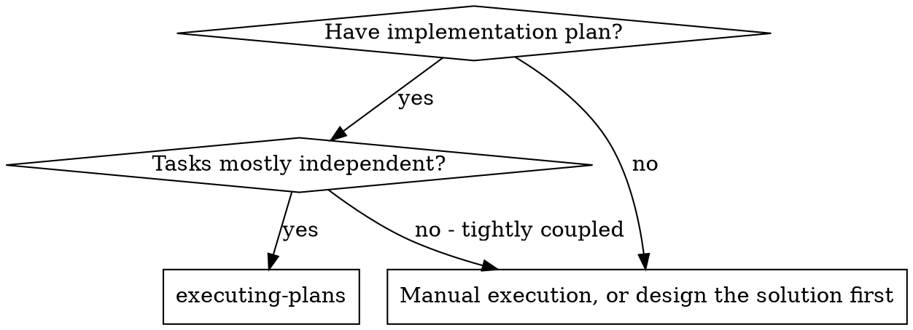
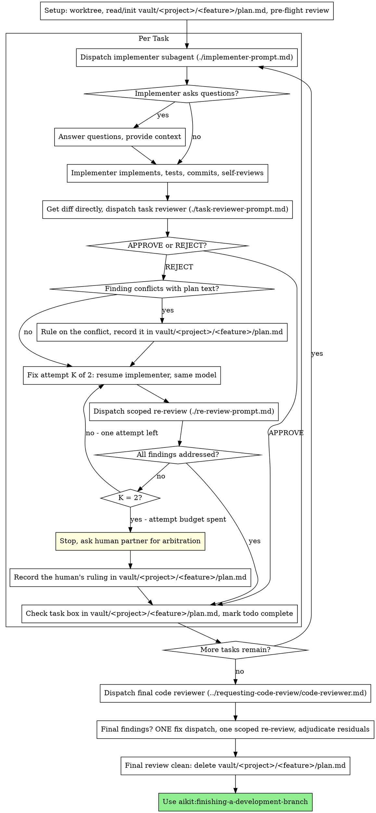

# Executing Plans

Execute plan by dispatching a fresh implementer subagent per task, a task review (spec compliance + code quality) after each non-exempt task, and a broad whole-branch review at the end.

**Why subagents:** You delegate tasks to specialized agents with isolated context. By precisely crafting their instructions and context, you ensure they stay focused and succeed at their task. They should never inherit your session's context or history — you construct exactly what they need. This also preserves your own context for coordination work.

**Core principle:** Fresh subagent per task + task review (spec + quality) + broad final review = high quality, fast iteration

**Narration:** between tool calls, narrate at most one short line — `vault/<project>/<feature>/plan.md`
and the tool results carry the record.

**Continuous execution:** Do not pause to check in with your human partner between tasks. Execute all tasks from the plan without stopping. The only reasons to stop are the five named below, or all tasks complete. "Should I continue?" prompts and progress summaries waste their time — they asked you to execute the plan, so execute it.

**Rulings, not stalls.** A running plan does not wait on a human for every
decision. Conflicts, ambiguities, plan defects — decide them yourself. The
spec is the binding authority, the plan is its argument, and your judgment
settles what neither answers. Record every decision in `vault/<project>/<feature>/plan.md` as
`Ruling: <what you decided> — <why> — <what it costs if wrong>`, and keep
going. A wrong ruling costs rework your human partner can see and undo; a
session parked on a question costs their whole day and buys nothing.

Five things stop you, and only these: an irreversible or destructive
operation; a security-sensitive action; a side effect outside this worktree
that norms say you ask about first (a merge, a push to a shared branch, a
publish); a task whose second fix attempt still fails review; and a plan so
broken that every path forward is a guess. For those, stop and ask.

## When to Use



## The Process



## Setup

Ensure the work happens in an isolated workspace: use
aikit:isolating-the-workspace to create one or verify the existing one.
Never start implementation on a main/master branch without your human
partner's explicit consent.

Conversation memory does not survive compaction. In real sessions,
orchestrators that lost their place have re-dispatched entire completed task
sequences — the single most expensive failure observed. Track progress in
`vault/<project>/<feature>/plan.md`, not only in todos.

- The plan lives at `vault/<project>/<feature>/plan.md`, in the vault that
  owns the project — never inside the project repository. It is the one
  file: the plan text, the spec pointer, and the live status, tracked with
  standard GitHub checkboxes. There is no separate workspace, ledger, or
  review-package directory.
- Check for an existing `vault/<project>/<feature>/plan.md` before writing
  one. If it names your plan and its Goal, a `- [x]` task is DONE — do not
  re-dispatch it; resume at the first `- [ ]` task. A task whose last
  checklist line is an open `attempt` note is mid-loop: resume there. A
  `plan.md` naming a different feature belongs to a different feature
  directory and is never yours to read or write.
- **The attempt budget lives here, not in your head.** Before each attempt at
  a task, add a line under it: `- [ ] Task N — attempt K/2: <what changed
  since the last one>`, and read back the task's existing lines first.
  Finding `attempt 2/2` already recorded and unresolved means the attempt
  budget is spent — stop and ask your human partner for arbitration, even
  with no memory of the earlier attempt. Compaction erases attempt counts
  before it erases anything else.
- `vault/<project>/<feature>/plan.md` is your recovery map: the commits it
  names exist in the project's git history even when your context no longer
  remembers creating them. After compaction, trust the file and `git log`
  over your own recollection.
- The vault sits outside every project repository, so `git clean -fdx` in a
  project cannot touch it.

Read the plan once, note its context and Global Constraints, and create a
todo per task. If the plan names a Spec, read that too: the spec is the
authority the plan argues from, and conflicts inside the plan resolve
against it. A plan with no reachable spec gets a note in `vault/<project>/<feature>/plan.md`
saying so — rulings made without one are provisional.

Before dispatching Task 1, scan the plan once for conflicts, writing down
what you checked as you check it:

- tasks that contradict each other or the plan's Global Constraints
- anything the plan explicitly mandates that the review rubric treats as a
  defect (a test that asserts nothing, verbatim duplication of a logic block)

The scan's output is a table, not a verdict. One row for every pair of tasks
that share a file or an interface: the two tasks, what one produces against
what the other consumes, and what you found. One row for every task: whether
its own text agrees with itself — the tests it specifies against the code it
specifies, the files it creates against the files it later touches. "The scan
is clean" without those rows is not a scan you ran.

Write the table into `vault/<project>/<feature>/plan.md`, under a `## Pre-flight scan` heading.
Rule on everything you find before execution begins — each finding against
the plan text that mandates it — and record each ruling under a `## Rulings`
heading in the same file. If the scan is clean, proceed without comment.
Rule on each conflict it surfaces — the spec is the binding authority, the
plan is its argument — record the ruling beside its row, and dispatch
Task 1. The review loop remains the net for conflicts that only emerge from
implementation.

## Model Selection

**aiKit fixes the model per role. It is not a per-task judgement call, and
there is no automatic escalation between models.**

| Role | Model | Why |
|---|---|---|
| `aikit:planner` | **opus** | Planning is evaluative work: reading the spec against the codebase and deciding what the tasks are — a wrong plan is the most expensive failure this method has, so it gets the strongest available judgement. |
| `aikit:reviewer` | **sonnet** | The review is the safety net every task passes through, but it does not need the ceiling tier by default. A human partner can dispatch a review manually on opus for a security-sensitive audit, or after two consecutive fix attempts still fail review — see `aikit:routing-failures`. |
| `aikit:probe` | **sonnet** | A probe produces a finding, not code — bounded and low-stakes. |
| `aikit:implementer` | **sonnet** | Most production work does not need the ceiling tier. |
| `aikit:explorer` | sonnet | High-volume reading, low judgement. |
| `aikit:verifier` | sonnet | Runs the registry's command and reports what came back. |

Each archetype carries this in its frontmatter, so dispatching by archetype
name gets the right model without you specifying one. No role escalates
automatically: a failed pass is answered with more context, a narrower
target, a probe, or fresh eyes at the same tier — never a bigger model
picked in the moment. If two attempts at the same task both fail, stop and
ask your human partner for arbitration (`aikit:routing-failures`); they may
choose to re-dispatch on a stronger model themselves, but that is their call,
not an automatic step.

**When a task names a project's domain expert instead (`Agent: api-expert`),
that agent carries its own model, and it is not necessarily the right tier.**
Check the project's registry file: on one project, `schema-expert` and
`api-expert` are already opus, while `ui-expert` and `docs-expert` are
sonnet. Domain knowledge and model tier are separate choices.

### The consequence you have to plan around

A retry must always change something real:

- more context in the brief (the interfaces, the constraint, the trap it hit);
- a narrower target (split the task, dispatch the remainder separately);
- a `aikit:probe` first, so the attempt stops guessing at an unknown.

Re-dispatching the same brief to the same tier is not an attempt. It is a coin
flip charged to your attempt budget. **The attempt budget is two.** When the
second attempt also fails, stop dispatching and ask for arbitration — see
`aikit:routing-failures`.

**Always pass the model explicitly when you dispatch anything that is not one
of these archetypes.** An omitted model inherits your session's, which
silently defeats the table above.

## Optional event log

If the environment variable `AIKIT_EVENTS_FILE` names a writable file, append
one JSON line to it (create the file if absent) each time you dispatch a
subagent and again when its report arrives — never otherwise, and never a
partial line.

Dispatch: `{"event":"dispatch","role":"<archetype or agent name>","project":"<name>","feature":"<slug>","task":<N>,"attempt":<K>,"model":"<model>","ts":"<ISO 8601>"}`.
Report: the same fields plus `"status":"success"` or `"status":"failure"`,
read off the implementer's `STATUS:` line.

`AIKIT_EVENTS_FILE` unset → skip this entirely: no file, no probing for one.

## The Task Sequence

**Batch small same-shape work.** When the plan lists several tasks that are
each a small, independent edit of the same kind — the same one-line fix,
constant change, or field addition repeated across files — do not dispatch
one subagent per task. Compose ONE dispatch brief listing every file and
its change, send the whole batch to a single subagent, and review its diff
as one unit. Reserve one-dispatch-per-task for work that needs its own
judgment, its own tests, or its own review surface.

Everything you paste into a dispatch prompt — and everything a subagent
prints back — stays resident in your context for the rest of the session
and is re-read on every later turn. Hand artifacts over as files.

**Waiting on dispatched subagents:** never poll a wait interface with
short timeouts, and never sit in one silent, open-ended wait either.
While you have local work — updating `vault/<project>/<feature>/plan.md`, packaging the next
review, reading reports — keep working; child results arrive on their own.
When you are genuinely idle, wait in bounded stretches (five to ten
minutes, where your platform allows), and between stretches post one
line of status and reconcile your live children: list them, and chase
any that finished without reporting. A bounded stretch keeps nearly
all of a long wait's efficiency while guaranteeing a stuck or lost
child is noticed within minutes, not at the end of the session.

### Règle de routage dynamique du modèle par tâche

Before assembling the dispatch payload, read the `Model:` field under the
current task's heading in `vault/<project>/<feature>/plan.md`.

- **Absent** → `sonnet`. Nothing to confirm.
- **`Model: sonnet`** → apply it directly. Not an escalation.
- **`Model: opus`** → this is the planner's **proposal**, not a decision. It
  is only a legitimate proposal when the task itself meets one of the
  criteria in `aikit:writing-plans`' Task Structure (concurrent state or
  distributed locking; a math/crypto algorithm with strict formal
  invariants; a cross-cutting refactor touching more than 4 modules with no
  prior integration tests). Before dispatching **this task** on opus, name
  the task and the criterion to your human partner and get their explicit
  confirmation — the same rule that already governs escalating
  `aikit:planner` or `aikit:reviewer` to opus: **no escalation to opus is
  ever automatic in this method.** Without confirmation, dispatch on
  `sonnet` and record the disagreement in `vault/<project>/<feature>/plan.md`.

**No propagation.** A task's `Model:` field — confirmed opus, sonnet, or
absent — governs that task alone. Task N+1 is read fresh from its own
`Model:` field, or defaults to `sonnet`; it never inherits Task N's model.

### 1. Dispatch the implementer — minimalist protocol

Record BASE (`git rev-parse HEAD`) before dispatching — the review diff and
fix-round diffs need it. If `AIKIT_EVENTS_FILE` is set, append the dispatch
line (see Optional event log) before sending the prompt.

**The dispatch prompt carries four things, and nothing else:**

1. the task's identity in `vault/<project>/<feature>/plan.md` — "Task N: [name]" — with an
   instruction to read that section there first;
2. the target file paths (Create/Modify/Test), copied from Task N's Files
   block;
3. the test command that proves the task;
4. at most one constraint — from Global Constraints or
   `<project>/heuristics.md` — when it bears directly on this task, per
   `aikit:budgeting-context`'s read cascade.

**Forbidden in the dispatch prompt:** pasted code excerpts, file contents,
diffs, or a summary of the conversation or of earlier tasks. A task's
Interfaces block already lives inside `vault/<project>/<feature>/plan.md` — the implementer
reads it there, with its own tools; the orchestrator never retypes it.
A dispatch prompt describes one task, not the session's history — a real
session's dispatch once hit 42k chars, 99% of it pasted history.

- The dispatch carries the no-subagents contract (it is in the
  implementer template): the implementer never dispatches subagents —
  not helpers, and never a reviewer. Review arrives from you, after the
  report. In real sessions, every reviewer a worker spawned duplicated
  the task review the orchestrator dispatched anyway — a full extra
  review seat per task.
- If an earlier task parked a finding in the area this task touches, carry
  a one-line pointer to it — not its text.
- Record the implementer's agent identity from the dispatch result — both
  fix attempts resume this agent, in the same live conversation, so it
  keeps its own memory of what it tried. No report file persists that
  memory outside the agent — there is nothing left to read if the agent
  itself is gone, which is why a fix attempt always tries to resume it
  first (see Handle the report, below).
- **Which agent:** if the task carries an `Agent:` line, dispatch that domain
  expert from the project's registry — it knows conventions the generic
  archetype does not. Otherwise dispatch `aikit:implementer`.
- Never dispatch multiple implementation subagents in parallel (conflicts).
  **One exception, and it must hold completely:** the tasks declare
  `Depends on: none`, their Files blocks are disjoint, and each runs in its own
  git worktree (`aikit:isolating-the-workspace`). If any of the three is missing,
  sequence them. A shared file beats any dependency block.

Template: [implementer-prompt.md](implementer-prompt.md)

### 2. Handle the report — hermetic in, hermetic out

The implementer returns exactly three lines: `STATUS`, `FILES`, `TEST` (see
`implementer-prompt.md`). Nothing else reaches your context from it — no
diff, no log, no narrative. Record those three lines verbatim as the task's
checklist annotation in `vault/<project>/<feature>/plan.md` before doing anything else; that is
now the only place the attempt's detail lives. If `AIKIT_EVENTS_FILE` is set,
append the report line (see Optional event log) using the `STATUS` you just
recorded.

**`STATUS: SUCCESS` or `STATUS: SUCCESS (concern: ...)`:** First run the
drift check — `aikit:checking-plan-drift`, using the BASE you recorded before
dispatching. It is mechanical and takes seconds, and it is the only thing
that catches a plan quietly abandoned. Drift is routed with
`aikit:routing-failures` before any review: reviewing code whose scope
already left the plan reviews the wrong question. A concern about
correctness or scope gets addressed before review; an observational concern
(e.g. "this file is getting large") is noted in `vault/<project>/<feature>/plan.md` and does
not block review.

**Task-review exemption:** when the task's tests pass, its diff touches **30
lines of code or fewer**, and it changes no public API or shared contract,
you may skip the per-task `aikit:reviewer` dispatch and move straight to the
next task. Record the exemption on the task's checklist line in
`vault/<project>/<feature>/plan.md` (`- [x] Task N — review skipped: exemption,
<line count> lines`) so the final whole-branch review can see which tasks it
is seeing for the first time. **The final whole-branch review stays
mandatory regardless** — it is the only gate an exempted task still passes
through. When in doubt about the line count or the contract boundary,
dispatch the reviewer; the exemption is for the obviously small case, not a
default to reach for.

Otherwise, get the diff directly — `git diff BASE..HEAD -U10` (BASE is the commit
you recorded before dispatching the implementer, so this diff is exactly
this task's attempt — never `HEAD~1`, which means "the single most recent
commit" and silently drops everything earlier in a multi-commit task) — and
dispatch the task reviewer with the commit list (`git log --oneline BASE..HEAD`),
the stat summary (`git diff --stat BASE..HEAD`), and that diff. Hand these to
the reviewer as a file path when your harness supports one (write the diff to
your scratch directory, not the vault or the project repository — it is not
a method or project artifact), so it never enters your own context; paste it
inline only when no scratch file is available. There is no separate review-package
step — the diff itself is the package.

**`STATUS: FAILURE: <reason>`:** **Route it with `aikit:routing-failures`** —
the reason names the kind of stop, and the nature of the failure decides
whether you go down, up, or out. Guessing that wrongly is the most expensive
mistake available to you:
1. Missing context or fact → down: provide it, re-dispatch (resume the same
   agent), **record the attempt in `vault/<project>/<feature>/plan.md`**
2. Needs more reasoning → down: add the interface, constraint, or trap it
   hit — resume the same agent — and record the attempt; after 2 recorded
   failures, stop and ask your human partner for arbitration instead of
   dispatching a third
3. Technical unknown → down: dispatch `aikit:probe` with one written question
   and a stated bound
4. Task too large, or files outside its declared set → **up**: finish the
   independent tasks, then re-split
5. The plan or spec is wrong (the reason states a plan/code contradiction) →
   **up**: stop, write the cycle report, do not re-dispatch
6. A behaviour decision is missing, current work not wrong → **out**: see
   `aikit:routing-failures` for the derived-need/candidate discriminant

**Never** ignore an escalation or force the same model to retry without changes. If the implementer said it's stuck, something needs to change.

If the implementer asks questions — before starting or mid-task — answer
clearly and completely, provide additional context if needed, and don't
rush it into implementation. Questions and answers happen in the live
conversation with the agent; they never enter the three-line contract.

### 3. Review the task

Per-task reviews are task-scoped gates. The broad review happens once, at the
final whole-branch review. Never skip the task review, and never accept a
report missing either verdict — spec compliance AND task quality are both
required. Implementer self-review never replaces the task review; both are
needed.

- Hand the reviewer the diff directly: `git log --oneline BASE..HEAD`,
  `git diff --stat BASE..HEAD`, and `git diff -U10 BASE..HEAD` for the range.
  Redirect the three to one scratch file and pass the reviewer that path so
  the output never enters your own context and the reviewer sees the commit
  list, stat summary, and full diff with context in one Read call — or paste
  them inline when no scratch file is available. Use the BASE you recorded
  before dispatching the implementer — never `HEAD~1`, which silently
  truncates multi-commit tasks. Never dispatch a task reviewer without the
  diff.
- **Reviewer inputs:** the task reviewer gets two things — Task N's section
  in `vault/<project>/<feature>/plan.md` and the diff — plus the global constraints that
  bind the task. There is no separate report file; the implementer's
  three-line return is already recorded in `vault/<project>/<feature>/plan.md`'s checklist.
- The global-constraints block you hand the reviewer is its attention
  lens. Copy the binding requirements verbatim from the plan's Global
  Constraints section or the spec: exact values, exact formats, and the
  stated relationships between components ("same layout as X", "matches
  Y"). The reviewer's template already carries the process rules (YAGNI,
  test hygiene, review method) — the constraints block is for what THIS
  project's spec demands.
- Do not add open-ended directives like "check all uses" or "run race tests
  if useful" without a concrete, task-specific reason
- Do not ask a reviewer to re-run tests the implementer already ran on the
  same code — the `TEST:` line in `vault/<project>/<feature>/plan.md` names the command and result
- Do not pre-judge findings for the reviewer — never instruct a reviewer to
  ignore or not flag a specific issue. If you believe a finding would be a
  false positive, let the reviewer raise it and adjudicate it in the review
  loop. If the prompt you are writing contains "do not flag," "don't treat X
  as a defect," "at most Minor," or "the plan chose" — stop: you are
  pre-judging, usually to spare yourself a review loop.
The task reviewer may report "⚠️ Cannot verify from diff" items — requirements
that live in unchanged code or span tasks. These do not block the rest of the
review, but you must resolve each one yourself before marking the task
complete: you hold the plan and cross-task context the reviewer
lacks. If you confirm an item is a real gap, treat it as a failed spec
review — it enters the fix loop with the other findings.

Template: [task-reviewer-prompt.md](task-reviewer-prompt.md)

### 4. Fix, then stop at two attempts

The loop triggers when the review reports `REJECT`, or a ⚠️ item you
confirmed as a real gap. `APPROVE` — even with non-blocking suggestions
attached — does not trigger it.

Before the loop starts, two routes leave it immediately:

- Record non-blocking suggestions in `vault/<project>/<feature>/plan.md` as you go under the task
  (`- [ ] suggestion (deferred): <one-liner>`), and point the final whole-branch
  review at that list so it can triage which must be fixed before merge. A
  roll-up nobody reads is a silent discard. Non-blocking suggestions never
  enter the loop.
- A `REJECT` finding labeled plan-mandated — or any finding that conflicts with
  what the plan's text requires — is yours to rule on: weigh the finding
  against the plan text, decide with the spec as the binding authority, and
  record the ruling in `vault/<project>/<feature>/plan.md` before you act on it. Do not dismiss
  the finding because the plan mandates it, and do not dispatch a fix that
  contradicts the plan without a recorded ruling.

Everything else enters the loop. **The attempt budget is two.** Resume the
original implementer, at its fixed model (sonnet by default, or its expert's
tier). Send it the open findings verbatim — its context is intact: it knows
the task, the code, and its own choices. If your harness cannot send another
message to a live subagent, dispatch a fresh implementer with Task N's
section in `vault/<project>/<feature>/plan.md`, its checklist line recording the first
attempt's three-line return, and the open findings — that line is what
persists between attempts, since there is no separate report file.

**Every attempt:** the implementer fixes, re-runs the test command, and
returns the same three-line contract. Before re-dispatching the reviewer,
confirm the `TEST:` line names the covering command and a passing result;
then re-review. A one-line fix does not need the whole suite re-run.

**The re-review is scoped.** Get the diff directly — `git diff FIX_BASE..HEAD -U10`,
where FIX_BASE is the head the previous review saw — and dispatch
[re-review-prompt.md](re-review-prompt.md) with the findings list, Task N's
section, and that diff. The re-reviewer verdicts each finding ADDRESSED or
NOT ADDRESSED and flags new breakage in the fix diff only. Any new breakage
that would itself be a `REJECT` (functional bug, spec violation, security
regression) joins the open findings list. Out-of-scope observations go to
`vault/<project>/<feature>/plan.md` as deferred non-blocking suggestions — they never extend
the loop.

**After each attempt,** update the task's checklist line in `vault/<project>/<feature>/plan.md`:
`- [ ] Task <N> — attempt <K>/2: <X> addressed, <Y> open — <finding one-liners>; commits <a7>..<b7>`

Never fix findings yourself in the orchestrator session — your context stays
clean for coordination, and orchestrator fixes skip review.

**When attempt 2's re-review still leaves findings open, stop dispatching.**
Do not open a third attempt. Report to your human partner:

- the open findings, worst first;
- what both attempts tried and what each changed;
- your recommendation — fix it yourself, accept it as-is, or re-plan the
  task — and what you will do if they say nothing.

Wait for their ruling, then record it in `vault/<project>/<feature>/plan.md` under the task
(`Ruling: <what was decided> — <why> — <cost if wrong>`) before moving on.
This is the one point in the loop that is not yours to adjudicate alone —
two failed attempts means the method's own judgement stopped being enough.

### 5. Complete the task

When the review comes back clean — or your human partner has ruled on every
open finding after the second attempt — check the task's box in
`vault/<project>/<feature>/plan.md` and add a one-line note in the same edit:

- `- [x] Task <N> (commits <base7>..<head7>, review clean)`
- `- [x] Task <N> (commits <base7>..<head7>, ruling: <one-liner>)` after
  human arbitration

Then mark the todo complete and move on. Never move to the next task while
the review is `REJECT` and neither fixed nor ruled on by your human partner.

## Final Review

The final whole-branch review gets a diff too: get it directly
(`git diff MERGE_BASE..HEAD -U10`, MERGE_BASE = the commit the branch started
from, e.g. `git merge-base main HEAD`) to a scratch file and include that
path in the final review dispatch, so the final reviewer reads one file
instead of re-deriving the branch diff with git commands. Dispatch on the
most capable available model (see Model Selection), using
aikit:requesting-code-review's
[code-reviewer.md](../requesting-code-review/code-reviewer.md). Point it at
`vault/<project>/<feature>/plan.md`'s deferred-minor and parked lines so it can triage which
must be fixed before merge.

If the final whole-branch review returns findings, dispatch ONE fix subagent
with the complete findings list — not one fixer per finding.
Per-finding fixers each rebuild context and re-run suites; a real
session's final-review fix wave cost more than all its tasks combined.
Then run exactly one scoped re-review of the fix wave (get the diff
directly over the fix range, [re-review-prompt.md](re-review-prompt.md)).
Adjudicate any residual findings the same way a task's spent attempt budget
is handled: stop and ask your human partner to rule on the load-bearing
ones, and record what they decided in `vault/<project>/<feature>/plan.md`. Only the five
classes above stop you here. There is no second fix wave — residual
load-bearing findings surface to your human partner when
finishing-a-development-branch presents the options.

## Finish

Before you delete anything, collect every `Ruling:` line in `vault/<project>/<feature>/plan.md` —
preflight rulings, human arbitrations, all of them — into your final message
under "Rulings I made", in the order you made them, each with what it costs
if wrong. The list is exhaustive: if `vault/<project>/<feature>/plan.md` holds a ruling, the
list holds it. That list is the only place the decisions you took on your
human partner's behalf reach them — they read it and rework whatever you got
wrong. A ruling that dies with the file was a decision made in secret.

When the final whole-branch review is clean and its fixes are merged,
delete `vault/<project>/<feature>/plan.md` (`rm vault/<project>/<feature>/plan.md`) — the git history is
the record now.

Use aikit:finishing-a-development-branch.

## Common Rationalizations

| Excuse | Reality |
|--------|---------|
| "Close enough on spec compliance" | Reviewer found spec gaps = not done. Fix it, or spend the second attempt and ask for arbitration — those are the only exits. |
| "I'll fix it myself, dispatching is overhead" | Orchestrator fixes pollute your context and skip review. Resume the implementer. |
| "One more attempt will converge" | Past two attempts, retries don't converge — the failure is structural. Stop and ask. |
| "The reviewer will just find something new anyway" | Scoped re-reviews verify fixes; they cannot wander. New findings on untouched code go to `vault/<project>/<feature>/plan.md`, not the loop. |
| "This finding is obviously wrong, I'll drop it" | Silent discards are forbidden — raise it with your human partner, or fix it. |
| "The fix was small, skip the re-review" | Unreviewed fixes are how regressions land. Every attempt ends with a scoped re-review. |
| "Reviews slow the loop down" | The loop without reviews is just unverified churn. Reviews are the loop's brakes and steering. |
| "Plan bookkeeping is overhead" | `vault/<project>/<feature>/plan.md` is what survives compaction. Orchestrators without one have re-dispatched entire completed task sequences. |
| "The implementer spawned its own reviewer — free extra assurance" | It's a duplicate seat reviewing the same diff; the task review is the gate. A worker-spawned reviewer is a defect to flag, not rigor. |

## Example Workflow

```
You: I'm using executing-plans to execute this plan.

[Setup: worktree verified]
[Read vault/<project>/<feature>/plan.md once — no existing checkmarks, fresh start]
[Create todos for all tasks]

Task 1: Hook installation script

[Dispatch implementer: "Task 1" + Files block paths + test command — read vault/<project>/<feature>/plan.md yourself]

Implementer: "Before I begin - should the hook be installed at user or system level?"

You: "User level (~/.config/aikit/hooks/)"

Implementer: STATUS: SUCCESS
  FILES: bin/install-hook, tests/install-hook.test.js
  TEST: npm test -- install-hook: 5 passed

[git diff BASE..HEAD -U10; dispatch task reviewer with the diff]
Task reviewer: Spec ✅ - all requirements met, nothing extra.
  Strengths: Good test coverage, clean. Non-blocking suggestions: none.
  Verdict: APPROVE.

[vault/<project>/<feature>/plan.md: - [x] Task 1 (commits a1b2c3d..d4e5f6a, review clean)]

Task 2: Recovery modes

[Dispatch implementer: "Task 2" + Files block paths + test command — read vault/<project>/<feature>/plan.md yourself]

Implementer: STATUS: SUCCESS
  FILES: src/recovery.js
  TEST: npm test -- recovery: 8 passed

[git diff BASE..HEAD -U10; dispatch task reviewer with the diff]
Task reviewer: Spec ❌:
  - Missing: Progress reporting (spec says "report every 100 items")
  Blocking issues: spec violation — no progress reporting (src/recovery.js)
  Verdict: REJECT.

[Fix attempt 1/2: resume the implementer with the finding]
Implementer: STATUS: SUCCESS
  FILES: src/recovery.js
  TEST: npm test -- recovery: 10 passed

[git diff FIX_BASE..HEAD -U10; dispatch scoped re-review]
Re-reviewer: Missing progress reporting — ADDRESSED (src/recovery.js:41).
  New breakage: none. Verdict: all findings addressed.

[vault/<project>/<feature>/plan.md: - [x] Task 2 (commits d4e5f6a..b7c8d9e, review clean; attempt 1/2 used)]

...

[After all tasks]
[git diff MERGE_BASE..HEAD -U10; dispatch final code-reviewer, most capable model]
Final reviewer: All requirements met. Deferred minors triaged: none block merge.

[Delete vault/<project>/<feature>/plan.md — the record now lives in git]

Done! Using aikit:finishing-a-development-branch.
```

## Without subagents — the fallback

This is the same method run inline, for a session where subagents are
unavailable. It is a degraded mode, not a choice: the fresh-reviewer guarantee
is gone, because the context that wrote the code is the context that reviews it.
Say so in the verdict.

1. **Load and review the plan.** Ensure an isolated workspace
   (`aikit:isolating-the-workspace`). Read the plan. Review it critically and raise
   concerns with your human partner before starting. Create one todo per task.
2. **Execute task by task.** Mark in progress, follow each step exactly, run
   every verification the step names, mark complete. Never batch two tasks.
3. **Finish.** Use `aikit:finishing-a-development-branch`.

**Stop and ask** on a blocker, a critical gap in the plan, an instruction you do
not understand, or a verification that fails repeatedly. Return to step 1 when
the plan changes or the approach needs rethinking. Never start implementation on
`main` or `master` without explicit consent.
